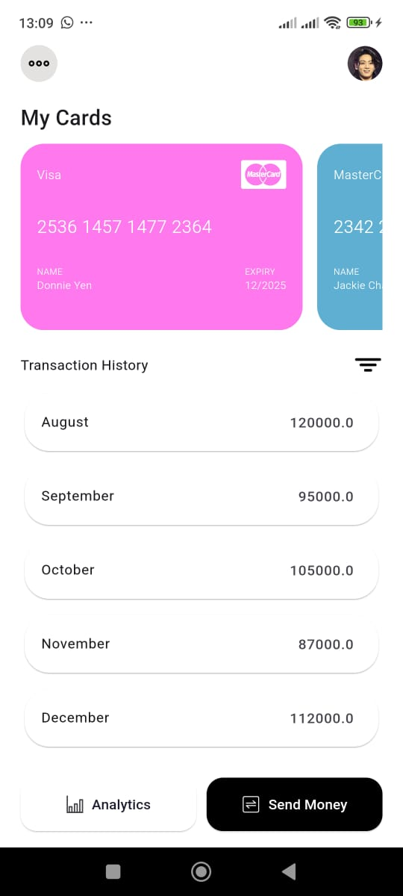

# credbevy

CredBevy is a modern FinTech mobile application built with Flutter and Stacked architecture. It allows users to manage transactions, transfer money, and view their balance seamlessly.

📌 Features

User Authentication (Sign up, Login)

Transaction History

Transfer Money with secure API calls

Beneficiaries Management

Balance Tracking

State Management with Stacked

🛠️ Installation & Setup

1️⃣ Prerequisites

Ensure you have the following installed:

Flutter SDK (>=3.22.3)

Dart SDK (>=3.22.3)

Android Studio / Xcode

Firebase Setup (For authentication & storage)

2️⃣ Clone the Repository

  git clone https://github.com/sparklinglily/credbevy.git
  cd credbevy

3️⃣ Install Dependencies

  flutter pub get

5️⃣ Run the Application

  flutter run

📂 Project Structure

models/ - Data models (e.g., UserModel, TransactionModel)

services/ - API services (e.g., ApiService.dart for handling HTTP requests)

viewmodels/ - State management using Stacked

views/ - UI screens (e.g., TransferMoneyPage, BeneficiaryList)

widgets/ - Reusable UI components

